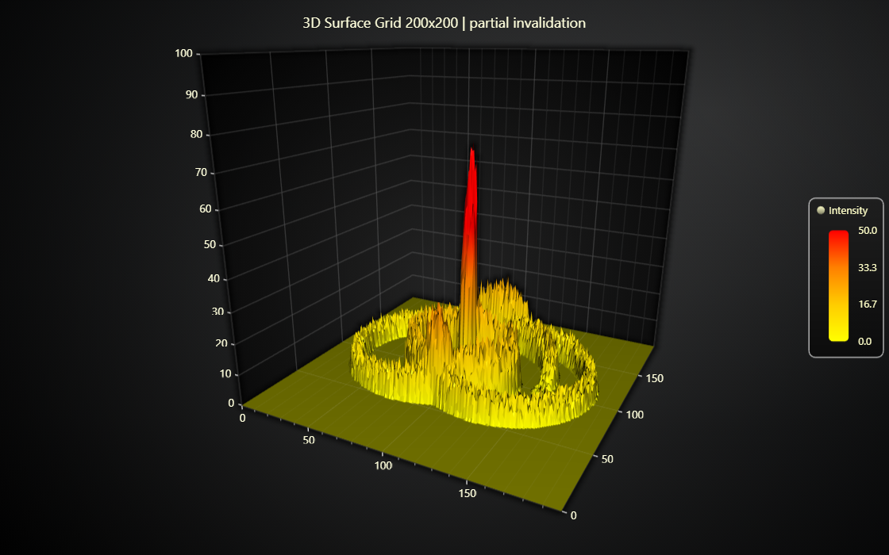

# JavaScript Surface Partial Invalidation Chart

This demo application belongs to the set of examples for LightningChart JS, data visualization library for JavaScript.

LightningChart JS is entirely GPU accelerated and performance optimized charting library for presenting massive amounts of data. It offers an easy way of creating sophisticated and interactive charts and adding them to your website or web application.

The demo can be used as an example or a seed project. Local execution requires the following steps:

-   Make sure that relevant version of [Node.js](https://nodejs.org/en/download/) is installed
-   Open the project folder in a terminal:

          npm install              # fetches dependencies
          npm start                # builds an application and starts the development server

-   The application is available at _http://localhost:8080_ in your browser, webpack-dev-server provides hot reload functionality.

## Description

This example showcases the _partial data update_ feature of `SurfaceGridSeries`.

Surface Grid Series allows updating any rectangular sub-section of grid data without affecting any additional data. LightningChart JS has optimized this particular use case really well, whereas most traditional data visualization tools would have to prepare the entire visualization again even if only a small section of data needs to be updated.

In this example, there is a small focus area which is moving periodically along the XZ plane. Every frame, the height data within this focus area is changed.

More commonly, the partial data update feature is used to load large data sets in several smaller "chunks", as showcased in the [Chunked Surface Grid Chart Example](https://lightningchart.com/lightningchart-js-interactive-examples/examples/lcjs-example-0916-surfaceChunkLoad.html).

# More Surface Examples

-   [Chunked Surface Grid Chart](https://lightningchart.com/lightningchart-js-interactive-examples/examples/lcjs-example-0916-surfaceChunkLoad.html) | This example shows how surface grid series can be split into sub sections which are loaded individually for better performance and response time.

-   [Intensity Surface Grid Chart](https://lightningchart.com/lightningchart-js-interactive-examples/examples/lcjs-example-0914-surfaceIntensityGrid.html) | This example showcases how surface grid series can be colored based on a different data set than the height map used in this example.

-   [Real-Time Audio Spectrum Surface Chart](https://lightningchart.com/lightningchart-js-interactive-examples/examples/lcjs-example-0913-surfaceScrollingGrid.html) | This example showcases using real-time data source with surface series.

-   [All Surface Examples](https://lightningchart.com/lightningchart-js-interactive-examples/search.html?t=surface)

## API Links

* [3D chart]
* [3D axis]
* [Paletted Fill]
* [Color lookup table]
* [Color RGBA factory]
* [Color shading styles (3D)]
* [Surface Grid Series]
* [Legend Box]
* [Axis scroll strategies]
* [Point Series 3D]

## Support

If you notice an error in the example code, please open an issue on [GitHub][0] repository of the entire example.

Official [API documentation][1] can be found on [LightningChart][2] website.

If the docs and other materials do not solve your problem as well as implementation help is needed, ask on [StackOverflow][3] (tagged lightningchart).

If you think you found a bug in the LightningChart JavaScript library, please contact sales@lightningchart.com.

Direct developer email support can be purchased through a [Support Plan][4] or by contacting sales@lightningchart.com.

[0]: https://github.com/Arction/
[1]: https://lightningchart.com/lightningchart-js-api-documentation/
[2]: https://lightningchart.com
[3]: https://stackoverflow.com/questions/tagged/lightningchart
[4]: https://lightningchart.com/support-services/

© LightningChart Ltd 2009-2022. All rights reserved.

[3D chart]: https://lightningchart.com/js-charts/api-documentation/v6.0.0/classes/Chart3D.html
[3D axis]: https://lightningchart.com/js-charts/api-documentation/v6.0.0/classes/Axis3D.html
[Paletted Fill]: https://lightningchart.com/js-charts/api-documentation/v6.0.0/classes/PalettedFill.html
[Color lookup table]: https://lightningchart.com/js-charts/api-documentation/v6.0.0/classes/LUT.html
[Color RGBA factory]: https://lightningchart.com/js-charts/api-documentation/v6.0.0/functions/ColorRGBA.html
[Color shading styles (3D)]: https://lightningchart.com/js-charts/api-documentation/v6.0.0/variables/ColorShadingStyles.html
[Surface Grid Series]: https://lightningchart.com/js-charts/api-documentation/v6.0.0/classes/SurfaceGridSeries3D.html
[Legend Box]: https://lightningchart.com/js-charts/api-documentation/v6.0.0/classes/Chart.html#addLegendBox
[Axis scroll strategies]: https://lightningchart.com/js-charts/api-documentation/v6.0.0/variables/AxisScrollStrategies.html
[Point Series 3D]: https://lightningchart.com/js-charts/api-documentation/v6.0.0/classes/PointSeries3D.html

